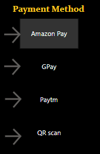
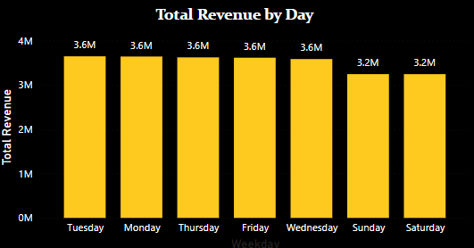
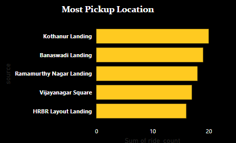
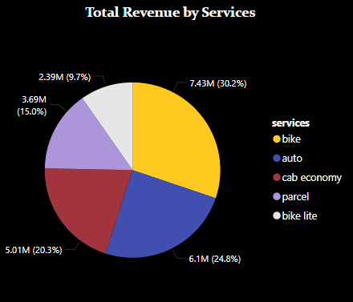
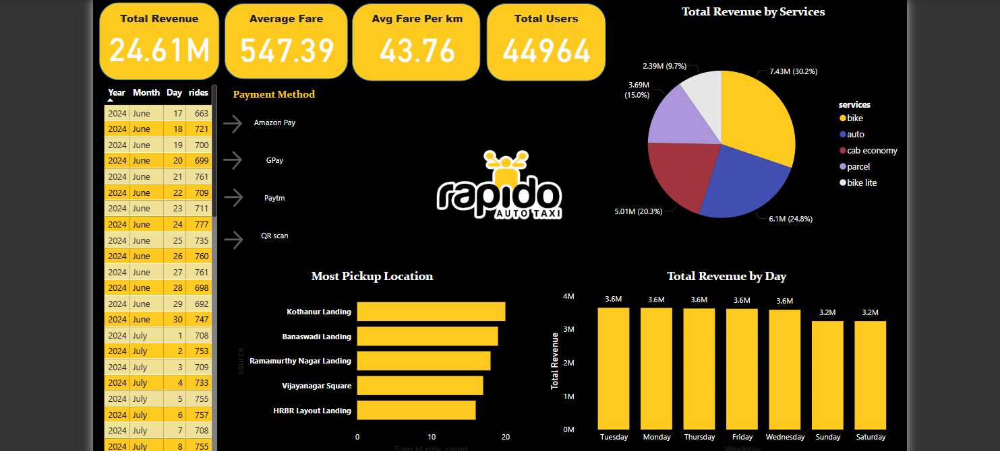

# 🚀 Rapido Ride-Sharing Data Analysis (Bangalore)

This project is an end-to-end data analysis of Rapido ride-sharing data from Bangalore, using Python, SQL, Excel, and Power BI. The goal was to extract meaningful business insights from real-world data and present them in an interactive dashboard.

---

## 🧰 Tools & Technologies Used

- **Power BI** – Used first for data cleaning and transformation (`Rapido_Transform.pbix`) using Power Query  
- **Python** – For converting ride duration (`mm:ss`) into total seconds to support further analysis  
- **SQL** – To perform deep data exploration and generate insights from the cleaned dataset  
- **Power BI** – Again used to build the final interactive dashboard (`Rapido_Dashboard.pbix`)  
- **Excel** – For initial data review and basic formatting checks

---

## 📊 Dataset Overview

The dataset contains detailed ride information including:

- Service type (e.g., Bike, Auto, Cab)
- Date and time of ride
- Pickup and drop locations
- Fare details (ride charge, misc charges, total fare)
- Distance and duration
- Payment methods

---

## 📁 Project Folder Structure

```
rapido-data-analysis/
├── datasets/                     
│   └── rapido_cleaned.csv
├── notebooks/                   
│   └── convert_ride_time_to_seconds.ipynb
├── powerbi/                     
│   ├── Rapido_Transform.pbix     
│   └── Rapido_Dashboard.pbix     
├── sql/                         
│   ├── total_revenue.sql
│   ├── avg_fare.sql
│   ├── payment_method_usage_count.sql
│   ├── most_pickup_location.sql
│   ├── service_total_revenue.sql
│   ├── revenue_by_day.sql
│   └── average_fare_per_km.sql
├── visuals/                    
│   ├── payment_method_usage.png
│   ├── revenue_by_day.png
│   ├── top_pickup_locations.png
│   ├── revenue_by_service.png
│   └── dashboard_overview.png
└── README.md
```

---

## 🐍 Python Script

- `convert_ride_time_to_seconds.ipynb`: A Jupyter notebook that converts the ride duration from "mm:ss" format to total seconds. This helped standardize time for SQL and Power BI analysis.

---

## 🗃 SQL Queries

SQL was used to extract various insights from the cleaned dataset.

### Key Queries:

- `total_revenue.sql`: Total revenue generated across all rides.
- `avg_fare.sql`: Calculates average fare per ride.
- `payment_method_usage_count.sql`: Count of rides by payment method.
- `most_pickup_location.sql`: Top pickup points based on frequency.
- `service_total_revenue.sql`: Revenue grouped by ride service type.
- `revenue_by_day.sql`: Daily revenue trends.
- `average_fare_per_km.sql`: Normalized fare per kilometer.

---

## 📊 Power BI Dashboards

Two `.pbix` files are included:

- `Rapido_Transform.pbix`: Includes Power Query transformations.
- `Rapido_Dashboard.pbix`: Final interactive dashboard used for data storytelling.

---

## 📷 Dashboard Visuals

### 💳 Most Used Payment Methods


### 📅 Revenue by Day


### 🏙 Top Pickup Locations


### 🚗 Revenue by Service Type


### 🧾 Dashboard Overview


---

## 🔍 Key Insights

- Total revenue generated: ₹24.61 million
- Average fare per ride: ₹547.39
- Average fare per km: ₹43.76
- Most frequently used payment methods: GPay, Amazon Pay, Paytm
- Top pickup locations: Kothanur Landing, Banaswadi Landing, Ramamurthy Nagar
- Highest revenue comes from Bike and Auto services
- Revenue is fairly consistent Tuesday through Friday, with a slight drop on weekends

---

## 🧠 Learnings & Outcomes

This project gave me hands-on experience with a real-world dataset, using a mix of Python, SQL, and Power BI to build a complete analytical solution. I was able to derive key business insights and present them in a clean and interactive dashboard, demonstrating my ability to handle the full data analysis lifecycle.

---

## 📂 How to Run This Project

1. **Open `Rapido_Transform.pbix` in Power BI Desktop**  
   Perform data cleaning and transformation using Power Query.

2. **Run the Python notebook `convert_ride_time_to_seconds.ipynb`**  
   Convert ride durations from `mm:ss` format to total seconds and export the updated file.

3. **Use the SQL files**  
   Execute SQL queries on the cleaned dataset to extract insights (revenue, ride types, payment usage, etc.).

4. **Open `Rapido_Dashboard.pbix` in Power BI Desktop**  
   View the final interactive dashboard built from the transformed and analyzed data.


## 🙌 Credits, Data Source & License

- **Author:** Hrishav Das
- **Project Type:** Independent / Self-Initiated Project  
- **Purpose:** Developed solely for educational learning and portfolio demonstration

- **Dataset Source:** (https://www.kaggle.com/datasets/vishaldeoprasad/bangalore-rapido-ride-services-dataset?resource=download)
- 
  📄 The dataset is shared under the MIT License by the original uploader on Kaggle. Full credit to them.

---

## 📄 License

This project (code, analysis, visualizations, and documentation) is created by **Hrishav Das**.  
It is intended **only for educational and portfolio purposes**.

If you wish to use the analysis, visualizations, or code from this project,  
**please give proper credit to the original author — Hrishav Das.**


